# 回測模組完整規劃

> 2026-09-07。涵蓋 MC12 績效報告的全部欄位 + 機構級回測模組。
>
> **每個模組在開始寫之前，必須先登記驗證標準與失敗模式。**
> 沒有這一步，回測模組會變成「算得出數字就叫做完」——
> 而那正是 MDD 分母錯誤那類缺陷能存活的原因。

---

## 零 模組依賴總圖

```mermaid
flowchart TB
    subgraph M0["M0 事件層"]
        F["Fill · ClosedTrade · Bar"]
    end
    subgraph M1["M1 部位與帳務"]
        P["PositionBook"]
        E["Equity 含未平倉 mark-to-market"]
        C["Cost 手續費 + 期交稅"]
    end
    subgraph M2["M2 交易統計　MC12 核心"]
        T["筆數 · 勝率 · PF · 平均盈虧"]
        S["連續盈虧 · 持倉時間 · 最大單筆"]
        X["MAE / MFE"]
    end
    subgraph M3["M3 風險度量"]
        D["回撤族 MDD · ADD · CDaR · Ulcer · 水下時間"]
        T2["尾部 VaR · CVaR · 偏度 · 峰度"]
    end
    subgraph M4["M4 風險調整報酬"]
        R["Sharpe · Sortino · Calmar · Omega · RINA"]
    end
    subgraph M5["M5 歸因"]
        A1["各支貢獻度"]
        A2["多空拆分"]
        A3["時間切片 年/月/時段"]
        A4["市場狀態 多頭/空頭/盤整"]
    end
    subgraph M6["M6 組合"]
        K["相關性矩陣"]
        MR["邊際風險貢獻"]
        PM["組合 MDD · 總曝險 · 週轉率"]
    end
    subgraph M7["M7 穩健性"]
        WF["Walk-Forward 效率"]
        MC["Monte Carlo 重排 / bootstrap"]
        PS["參數敏感度 · 高原檢定"]
        PB["PBO 過擬合機率 · Deflated Sharpe"]
    end
    subgraph M8["M8 執行品質　需實戰資料"]
        SL["滑價分布"]
        FR["成交率 · 拒單率"]
        IS["實作落差 implementation shortfall"]
        LT["延遲分布"]
    end
    subgraph M9["M9 報告"]
        H["HTML tearsheet"]
        CS["CSV 逐筆 · 彙總"]
        PA["對帳報告"]
    end

    F --> P --> E
    C --> E
    F --> T & S & X
    E --> D & T2
    D --> R
    T2 --> R
    T --> A1 & A2 & A3 & A4
    E --> A1
    A1 --> K --> MR --> PM
    E --> PM
    T --> WF & MC & PS
    R --> PB
    WF --> PB
    M8 --> E
    M2 --> H
    M3 --> H
    M4 --> H
    M5 --> H
    M6 --> H
    M7 --> H
    M8 --> PA
```



**依賴方向永遠向上。** 下層錯了，上層全部無意義——
而上層的數字**看起來仍然合理**，這就是它危險的地方。

---

## 一 M1　部位與帳務層

### 為什麼它排第一

**MDD 分母錯誤那個事故就發生在這一層。** 儀表板用期初資金當分母算出 36.47%，
正確的滾動峰值分母是 31.53%，而且用期初資金會讓百分比破 100%
（原本那個 106.3% 就是這樣來的）。

### 模組

| 模組 | 內容 | 現況 |
|---|---|---|
| `PositionBook` | 多腿部位、加權平均進場價、`CurrentContracts` / `MaxContracts` | ✓ |
| `Ledger` | Fill → 逐日損益 → 權益曲線 | ✓ |
| **`mark_to_market`** | **每根 K 棒的未平倉市值** | **✗ 只有平倉才記帳** |
| `costs` | 手續費（依商品）+ 期交稅（依契約金額） | ✓ |
| **`margin`** | **保證金佔用、追繳門檻** | **✗** |

### ★ 未平倉市值是必須的，不是加分項

```
只算已實現   浮虧部位在砍掉之前完全看不出來
即時 mark    回測中的保護器才會真的觸發
```

**若不做，`MaxDrawdownGuard` 在回測裡永遠不會啟動，上線才第一次真的執行**——
那正是最危險的情況。

### 驗證標準

| # | 標準 | 失敗模式 |
|---|---|---|
| 1 | 權益曲線的**最後一點** = 期初 + 所有已平倉淨損益（全部平倉時） | 帳務漏記或重複記 |
| 2 | 任一時點 `equity[t] = 期初 + 已實現 + 未實現` | 未平倉沒接上 |
| 3 | 回撤分母永遠是**滾動峰值**，值域有界在 100% 內 | 用期初資金 → 破 100% |
| 4 | 逐日損益的**交易日切點**與 K 棒層共用同一個 `trading_day()` | 一天偏移，無法追查 |
| 5 | 成本 = 手續費 + 稅**分開計算**，稅隨成交價變動 | 用固定 42 → 高價時低估 |

**驗證方式**：構造已知答案的小案例，逐項斷言。

---

## 二 M2　交易統計層（MC12 績效報告的核心）

### MC12 欄位對照

MC12 的績效報告分四區。**每一欄都要有對應模組，缺一欄就是對帳缺一塊。**

#### 2.1 Performance Summary

| MC12 欄位 | 模組 | 現況 |
|---|---|---|
| Total Net Profit | `net_profit` | ✓ |
| Gross Profit / Gross Loss | `gross_profit` / `gross_loss` | ✓ |
| Profit Factor | `profit_factor` | ✓ |
| **Total Commission** | `total_commission` | **✗ 有算但沒獨立輸出** |
| **Total Slippage** | `total_slippage` | **✗ 目前為零** |
| Total Number of Trades | `n_trades` | ✓ |
| Winning / Losing Trades | `n_wins` / `n_losses` | ✓ |
| Percent Profitable | `win_rate` | ✓ |
| Avg Trade Net Profit | `avg_trade` | ✓ |
| Avg Winning / Losing Trade | `avg_win` / `avg_loss` | ✓ |
| **Ratio Avg Win / Avg Loss** | `payoff_ratio` | **✗ 有算沒輸出** |
| Largest Winning / Losing Trade | `largest_win` / `largest_loss` | ✓ |
| **Max Consecutive Winners / Losers** | `max_consec_win` / `max_consec_loss` | **✗** |
| **Avg Bars in Winning / Losing Trades** | `avg_bars_win` / `avg_bars_loss` | **✗** |
| **Max Shares / Contracts Held** | `max_contracts_held` | **✗ PositionBook 有但沒輸出** |
| **Account Size Required** | `account_size_required` | **✗** |
| **Return on Initial Capital** | `return_on_capital` | **✗** |
| **Annual Rate of Return** | `annual_return` | **✗** |

#### 2.2 Trade Analysis

| MC12 欄位 | 模組 | 現況 |
|---|---|---|
| **Total / Long / Short 三欄拆分** | `by_direction` | **✗** |
| **Avg Trade / Avg Win / Avg Loss（分多空）** | 同上 | **✗** |
| **Max Consecutive（分多空）** | 同上 | **✗** |
| **Avg Bars Held（分多空）** | 同上 | **✗** |

> **多空拆分不是裝飾。** 實戰紀錄的多空是 **56 : 3**，
> 而回測的組合方向性完全沒被檢視過。

#### 2.3 Periodical Returns

| MC12 欄位 | 模組 | 現況 |
|---|---|---|
| **年度 / 月度 / 週度損益表** | `periodical` | **✗** |
| **各期間的最佳 / 最差** | 同上 | **✗** |
| **獲利月份佔比** | 同上 | **✗** |

#### 2.4 MAE / MFE

| MC12 欄位 | 模組 | 現況 |
|---|---|---|
| **Maximum Adverse Excursion** | `mae` | **✗** |
| **Maximum Favourable Excursion** | `mfe` | **✗** |
| **Edge Ratio（MFE/MAE）** | `edge_ratio` | **✗** |

> **MAE / MFE 是唯一能回答「停損設得對不對」的東西。**
> L5 的診斷（94% 的交易走不到目標）就是靠 MFE 量出來的，
> 但那是我臨時寫的腳本，不是模組。

### 驗證標準

| # | 標準 | 失敗模式 |
|---|---|---|
| 1 | `Gross Profit + Gross Loss = Net Profit`（含成本） | 成本漏算或重複扣 |
| 2 | `n_wins + n_losses = n_trades`，**平手歸哪一邊要明確登記** | 平手被漏掉，勝率虛高 |
| 3 | `PF = Gross Profit / |Gross Loss|`，**Gross Loss = 0 時不得回傳無限大** | 除以零，或靜默回傳 0 |
| 4 | 多空拆分的三欄**相加等於總欄** | 分類漏掉某些交易 |
| 5 | MAE ≤ 0 ≤ MFE，且 `MAE ≤ 實際損益 ≤ MFE` | 用錯 K 棒範圍 |
| 6 | 每個 MC12 欄位**逐項對帳**，差異須歸因 | 少算一欄不會有人發現 |

---

## 三 M3　風險度量層

### 回撤族

| 度量 | 回答什麼 | 現況 |
|---|---|---|
| `max_drawdown` | 最壞的一次 | ✓ |
| `average_drawdown` | 平常有多深 | ✓ |
| `cdar_95` | 最壞 5% 的回撤平均。比 MDD 穩定 | ✓ |
| `ulcer_index` | 同時懲罰深度與持續時間 | ✓ |
| `underwater_ratio` | 處於回撤中的期數比例 | ✓ |
| `drawdown_duration` | 最長回撤持續期數 | ✓ |
| **`recovery_factor`** | **淨利 / MDD。回本能力** | **✗** |
| **`pain_index`** | **回撤的時間積分** | **✗** |
| **`edar_95`** | **熵回撤風險值** | **✗** |
| **`time_to_recovery`** | **每次回撤的回復天數分布** | **✗** |

### ★ 兩種 MDD 必須分開

MC12 報告有兩欄，我們只有一種：

```
Intraday Peak to Valley      逐 K 棒的權益（含未平倉）  ← 需要 M1 的 mark-to-market
Trade Close to Trade Close   只看平倉點的權益           ← 目前算的是這個
```

**兩者可以差很多。** 而風險控管要用前者——**部位在被砍之前承受的風險是真實的**。

### 尾部風險

| 度量 | 現況 |
|---|---|
| `cvar_95` | ✓ |
| `worst_realization` | ✓ |
| **`var_95`** | **✗** |
| **`skew` / `kurtosis`** | **✗ 報酬分布的形狀，決定 Sharpe 可不可信** |

### 驗證標準

| # | 標準 | 失敗模式 |
|---|---|---|
| 1 | `average_drawdown ≤ CDaR ≤ max_drawdown` | 尾部取樣錯邊 |
| 2 | `ulcer_index ≤ max_drawdown` | 均方根算錯 |
| 3 | **兩條 max_drawdown 相同的曲線，回復慢的 Ulcer 必較大** | 只算深度不算時間 |
| 4 | `max_drawdown = max(每日回撤曲線)`，兩者永不矛盾 | 兩處各自實作 |
| 5 | **組合 MDD < 各支 MDD 相加**（除非完全相關） | 相加 → 高估 58% |
| 6 | 回撤值域 `[0, 1]` | 分母用期初資金 |

---

## 四 M4　風險調整報酬

| 度量 | 公式核心 | 為什麼需要 | 現況 |
|---|---|---|---|
| **Sharpe** | 超額報酬 / 標準差 | 業界共同語言 | ✗ |
| **Sortino** | 超額報酬 / 下行標準差 | **只懲罰下行**，對非對稱分布較公平 | ✗ |
| **Calmar** | 年化報酬 / MDD | **最貼近期貨交易的直覺** | 部分 |
| **Omega** | 門檻以上機率加權 / 以下 | 不假設常態分布 | ✗ |
| **RINA Index** | MC12 專有 | 對帳需要 | ✗ |
| **Return Retracement Ratio** | MC12 專有 | 對帳需要 | ✗ |

### ★ 三個必須登記的前提

```
無風險利率      設多少？台灣定存或美債？影響 Sharpe / Sortino
年化週期        一年幾個交易日？252？還是台指的實際天數？
報酬序列頻率    逐日？逐筆？兩者的 Sharpe 差很多
```

**這三個沒登記，Sharpe 就是個沒有意義的數字。**

### 驗證標準

| # | 標準 | 失敗模式 |
|---|---|---|
| 1 | 無風險利率、年化週期、序列頻率**寫在輸出裡**，不是藏在程式碼 | 兩份報告用不同前提 |
| 2 | `Sortino ≥ Sharpe`（下行標準差 ≤ 全體標準差） | 下行取樣錯 |
| 3 | 報酬分布的**偏度與峰度一併輸出** | Sharpe 在厚尾分布下嚴重誤導 |
| 4 | Calmar 的分子分母**用同一資金基準** | 混用期初與峰值 |

---

## 五 M5　歸因層

| 模組 | 回答什麼 | 現況 |
|---|---|---|
| **各支貢獻度** | 誰賺誰賠，佔組合多少 | ✗ |
| **多空拆分** | 實戰是 56:3，回測呢？ | ✗ |
| **時間切片** | 年 / 月 / 星期 / 時段 | ✗ |
| **市場狀態拆分** | 多頭 / 空頭 / 盤整期間各自表現 | ✗ |
| **持倉時間分布** | 幾根 K 棒出場，尾巴多長 | ✗ |
| **出場標籤歸因** | 每個標籤的筆數 · 勝率 · 淨額 | 部分（報告有） |

### ★ 市場狀態拆分是最重要的一個

L2 停擺 443 天、L4「多頭市場零交易 = 正確行為」——
**這兩件事只有在市場狀態拆分下才看得出來是設計還是故障。**

而樣本外的衰退（L3 的 PF 從 1.396 掉到 0.192）也需要它才知道
是策略失效還是市場狀態不對。

### 驗證標準

| # | 標準 |
|---|---|
| 1 | 各切片的損益**相加等於總損益**，不重不漏 |
| 2 | 市場狀態的定義**事前登記**（例如日線 MA60 之上/下/橫盤），不可事後調整 |
| 3 | 各支貢獻度用**組合曲線**計算，不是各自曲線相加 |

---

## 六 M6　組合層

**這是你說的「整份上架組合策略的風險意識」，而它至今完全空白。**

| 模組 | 內容 | 現況 |
|---|---|---|
| **組合權益曲線** | 五支逐日損益相加，含未平倉 | ✗ |
| **組合 MDD** | 對組合曲線做一次 MDD | 函數有，沒接上 |
| **相關性矩陣** | 五支逐日損益的相關係數 | ✗ |
| **邊際風險貢獻** | 移除某支，組合 MDD 變多少 | ✗ |
| **總曝險** | 任一時點的總口數、淨口數 | 函數有，沒呼叫 |
| **週轉率** | 進出場頻率、部位持有時間佔比 | ✗ |
| **同時發訊號** | 幾根 K 棒上有 ≥2 支同時要進場 | ✗ |
| **保證金佔用** | 峰值保證金、追繳風險 | ✗ |

### ★ 硬規則

```
組合 MDD  =  五支每日損益逐日相加 → 合成一條曲線 → 再做一次 MDD
          ≠  各支 MDD 相加
```

**實測：相加 158,088 vs 組合 99,944，高估 58%。**

### 驗證標準

| # | 標準 | 失敗模式 |
|---|---|---|
| 1 | 組合曲線的每日損益 = 五支當日損益之和 | 對齊錯誤，某支的某天被漏掉 |
| 2 | **組合 MDD < 各支 MDD 之和**（除非相關係數全為 1） | 用相加當組合 |
| 3 | 各支的逐日損益序列**長度相同、日期對齊** | 長度不同會靜默截斷 |
| 4 | 總曝險 ≤ 上限，任一時點 | 保護器沒接上 |
| 5 | 相關性矩陣對稱、對角線為 1 | 計算錯誤 |

---

## 七 M7　穩健性層

**明確排在後面。理由寫清楚。**

| 模組 | 內容 | 何時做 |
|---|---|---|
| Walk-Forward 效率 | 樣本外 / 樣本內的績效比 | 成交模型變真實之後 |
| Monte Carlo 交易重排 | 打亂交易順序，看 MDD 分布 | 同上 |
| Monte Carlo bootstrap | 有放回抽樣，看報酬分布 | 同上 |
| 參數敏感度 / 高原檢定 | 參數微調時績效是否平滑 | 同上 |
| **PBO 過擬合機率** | 組合式交叉驗證下，樣本內最佳者在樣本外落到後半的機率 | 同上 |
| **Deflated Sharpe** | 扣掉多重測試偏誤後的 Sharpe | 同上 |

### 為什麼排後面

> **在成交模型還是樂觀假設的時候做穩健性分析，是在最佳化一個假的東西。**

而且硬規則說：**「Python 引擎在逐筆重現之前，不得用於任何新的參數掃描或邏輯評估。」**

### 但現在就要登記的一件事

**樣本外的衰退已經出現了：**

```
        樣本內 PF    樣本外 PF
L1        1.565        1.367
L3        1.396        0.192      ← 崩了
L5        1.331        0.928
```

**這個現象必須在 M7 建立時被解釋，不是被最佳化掉。**

---

## 八 M8　執行品質層

**需要實戰資料，是回測與實戰對帳的橋樑。**

| 模組 | 內容 | 資料來源 |
|---|---|---|
| **滑價分布** | 訊號價 vs 實際成交價 | 實戰紀錄 |
| **成交率 / 拒單率** | 送出的單有幾張成交 | 券商回報 |
| **實作落差** | 決策價 vs 最終成交價的總成本 | 兩者相減 |
| **延遲分布** | 下單 → 回報的時間，p50 / p99 | 券商回報 |
| **部分成交** | 幾張單被拆成多筆 | 實戰紀錄（**已知 30.5% 資料失真**） |

### ★ 這一層決定回測能不能等於實戰

```
現在        fill_mc12：觸價即成交、零滑價、無拒單、無部分成交
CLAUDE.md   滑價 1,000 NTD/邊/口 —— **設定值，不是量測值**
實際        未知
```

**只要成交模型是樂觀的，回測就永遠不會等於實戰。**

### 驗證標準

| # | 標準 |
|---|---|
| 1 | 滑價的 **p50 / p95 / p99 一併輸出**，不只平均 |
| 2 | 滑價依**單型分開**（市價 / 停價 / 限價），三者差異極大 |
| 3 | 滑價依**時段分開**（開盤 / 盤中 / 夜盤） |
| 4 | 用量測的滑價重跑回測，與實戰的差距必須縮小 |
| 5 | `is_measured` 旗標：未量測前，任何用它算出的風險數字都標註 |

---

## 九 M9　報告層

| 產出 | 內容 | 現況 |
|---|---|---|
| **HTML tearsheet** | 權益曲線 · 水下曲線 · 月度熱圖 · 全部指標 | 部分 |
| 逐筆 CSV | 欄位對齊 MC12 交易明細 | ✓ |
| 彙總 CSV | 可貼進 Excel | ✓ |
| **MC12 對帳報告** | 逐欄比對 + 差異歸因 | ✗ |
| **實戰對帳報告** | 回測 vs 實戰逐筆 | ✗ |
| **血緣戳記** | 每份報告帶 code/config/data/calendar 雜湊 | 算得出，**沒印** |

### ★ 血緣必須印在報告上

```
沒印    兩份報告放在一起，沒人知道是不是同一份程式碼跑的
印了    L3 那類「基準線自己從 360 變 361」結構上不可能發生
```

---

## 十 建置順序與理由

| 階段 | 模組 | 為什麼是這個順序 |
|---|---|---|
| **A** | `runtime/engine.py` 統一迴圈 | **現有兩份 runner 已讓我出錯兩次**。再加 live 就是三份 |
| **B** | M1 的 mark-to-market + margin | **不做，回測裡的保護器永遠不觸發** |
| **C** | M2 完整補齊（MC12 全欄位） | 對帳的基礎。缺一欄就是缺一塊 |
| **D** | M6 組合層 | **你要的風險管理。而且五支已跑得出逐筆，資料在手** |
| **E** | M3 / M4 / M5 補齊 | 依賴 B 與 C |
| **F** | M8 執行品質 | **需要你上傳實戰紀錄** |
| **G** | M9 報告整合 | 前面全部的呈現 |
| **H** | M7 穩健性 | **成交模型變真實之後才有意義** |

---

## 十一 貫穿全案的五條規則

**一、每個模組先登記驗證標準，再開始寫。**
標準寫成測試，測試先失敗，然後才寫實作。

**二、每個指標的前提寫在輸出裡。**
無風險利率、年化週期、序列頻率、成本模型、成交假設——
**藏在程式碼裡的前提，等於沒有前提。**

**三、單一數字一律搭配分布。**
MDD 搭 CDaR 與 Ulcer；平均滑價搭 p95 / p99；Sharpe 搭偏度峰度。
**單點統計在長尾分布下會騙人。**

**四、能相加的與不能相加的必須分開。**
損益可以相加，MDD 不行，Sharpe 不行，勝率不行。
**每個模組要標明它的組合語意。**

**五、任何「還沒量測」的東西要有旗標。**
`is_measured = False` 的滑價、`SOURCE_SHA256` 不符的資料、
超出驗證範圍的日曆——**全部要在報告上顯示，不是靜默使用預設值**。
