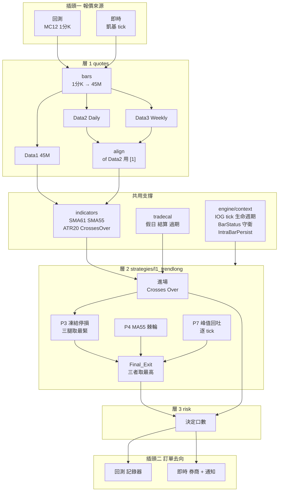
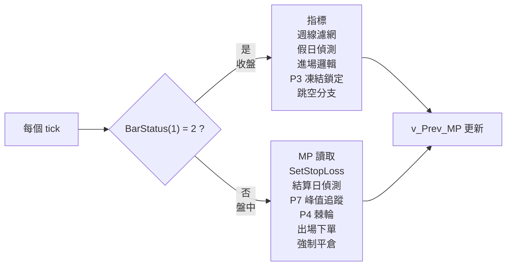
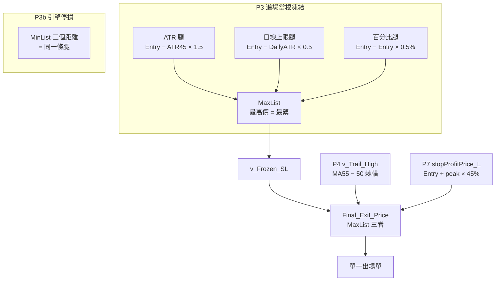

# L1 TrendLong 分層結構

> **45M · 三資料流 · IOG=true · 單一停損架構 · 一根最多三張單**
> 五支裡唯一需要 tick 生命週期的策略。移植順位 5（最後）。

---

## 一 全景

---

## 二 層別需求

| 層 | 模組 | L1 用到什麼 | 狀態 |
|---|---|---|---|
| **0** | `types/bar` | 45M / Daily / Weekly 三條 BarSeries | ✓ |
| | `types/stateful` | `v_Trail_High` 棘輪、`v_Prev_MP` | ✓ |
| | `instruments` | `BigPointValue` | ✓ |
| | `timing` | **tick 級時鐘**（其餘四支只需 bar close） | ○ |
| **支撐** | `indicators/core` | `Average` `AvgTrueRange` `MaxList` `MinList` **`Crosses Over`** | ✓ |
| | `tradecal` | 假日 · 結算 · 註冊表過期 | ✓ |
| | **`engine/context`** | **IOG · BarStatus 守衛 · IntraBarPersist** | ○ **L1 專屬** |
| | `engine/orders` | Market · Stop。**無 ExitFired，需並存管理** | ○ |
| | `engine/protective` | `SetStopContract` + `SetStopLoss` | ○ |
| **1** | `quotes/bars` | 1分K → **45M**（唯一用 45M 的策略） | ○ |
| | `quotes/align` | `AvgTrueRange(20)[1] of Data2` 的 `[1]` | ○ |
| **2** | `strategies/l1_trendlong` | — | ○ |
| **3** | `risk` | 決定口數 | ○ |
| **5** | `notify` / `broker` | — | ○ |

---

## 三 IOG 切分 — L1 專屬

> **`v_Prev_MP` 在守衛外**，所以 IOG 下記錄的是每個 tick 而非每根 K 棒。
> 註解宣稱「records the position of every bar」——語意不符（D-1）。
> `ReEntry_On = 0` 時惰性，啟用時會是問題。

**`IntraBarPersist` 三個變數**：`posbleProfit_Long` · `stopProfitPrice_L` · `v_Trail_High`
沒有它，這三個會在每個 tick 重置回 bar-open 值。

---

## 四 停損三層合一

> **V2.9 的教訓**：舊標頭把 P3 改述成「Entry − MaxList(distances)」，
> P3b 照著錯的形狀寫，取了**較鬆的一條腿**，寬 1.6–2.8 倍，橫跨整個 V2.6+ 世代。
> 而**驗證器把 bug 編碼進去了**，所以 bug 通過驗證。

---

## 五 出場與 J-3

```mermaid
flowchart TB
    MP{"MP > 0 ?"} -->|是| S3["Section 3<br/>必發一張<br/>TL_SL / TL_SP / TL_TP<br/>TL_TSL / TL_SL_Gap / TL_SP_Gap"]
    MP -->|是| S4["Section 4"]
    S4 --> CH{"else-if 鏈"}
    CH --> RE["TL_RegistryEnd"]
    CH --> HO["TL_Holiday<br/>Time ≥ 345"]
    CH --> SE["TL_Settlement<br/>Time ≥ 1230"]
    S4 --> KL["TL_Kill<br/>獨立 if，不在鏈上"]
    S3 --> CNT["一根最多三張"]
    CH --> CNT
    KL --> CNT

    style KL fill:#4a2020,stroke:#e8735e
    style CNT fill:#4a2020,stroke:#e8735e
```

> **J-3**：標頭自承「L1 can emit **two full-size market orders on one bar**」。
> 加互斥旗標會改變行為並破壞 anchor，**刻意不修**。
> `mc12` 模式必須照抄，修正只能進 `v2`。

---

## 六 狀態分層

| 類別 | 變數 | 重置 |
|---|---|---|
| **per-trade** | `v_SL_Locked` `v_Frozen_SL` | 空手 |
| **per-trade + IntraBarPersist** | `posbleProfit_Long` `stopProfitPrice_L` `v_Trail_High` | 空手 |
| **per-bar** | `Entry_P` `Exit_Price_*` `Final_Exit_Price` | 每根重算 |
| **跨交易（re-entry 用，須存活過平倉）** | `v_Frozen_Gap` `v_Frozen_MABase` `v_Frozen_SL_Orig` `v_Wk_Entry_Fast` `v_Wk_Entry_Slow` | 新訊號時清 |
| **跨交易** | `v_Prev_MP` | 腳本最末行 |
| **不移植** | `MyEquity` `Year_*` `txtID`（MDD 視覺化 40 行） | — |

---

## 七 執行層能力清單

| 能力 | L1 需要 | 其他四支 |
|---|:-:|---|
| Market 單 | ● | 全部 |
| Stop 單 | ● | 全部 |
| Limit 單 | · | L3 L5 |
| 單根多張並存 | ● | L3 L5 |
| 部分口數 | · | L5 |
| 腿綁定 | · | L5 |
| **tick 級評估** | ● | **無** |
| **IntraBarPersist** | ● | **無** |
| **BarStatus 守衛** | ● | **無** |
| `Crosses Over` | ● | **無** |
| 45M 網格 | ● | **無** |

---

## 八 移植檢查清單

- [ ] `.pla` SHA-256 釘死
- [ ] **兩次執行**重建 V3.1 anchor（舊筆數 476 vs 451 皆不採用）
- [ ] `engine/context` 以 tick 為原生、bar close 為特例
- [ ] `IntraBarPersist` 語意實作並測試
- [ ] `BarStatus` 守衛的邊界逐段核對
- [ ] P3 三腿 MaxList 價位 == P3b 三距離 MinList
- [ ] `v_Trail_High` 棘輪單調性斷言
- [ ] 標籤路由的 `0.001` 容差照抄，不改等號
- [ ] J-3 三張單行為在 `mc12` 照抄
- [ ] `Daily_ATR` 的 `[1]` 偏移
- [ ] 週線濾網用 **OR**（L5 用 AND，勿混）
- [ ] `Holiday_Flat_Time = 345`（非 415）
- [ ] IOG 行為改採**平行前向驗證**，決定連續一致天數 N
- [ ] MDD 視覺化確認不移植
