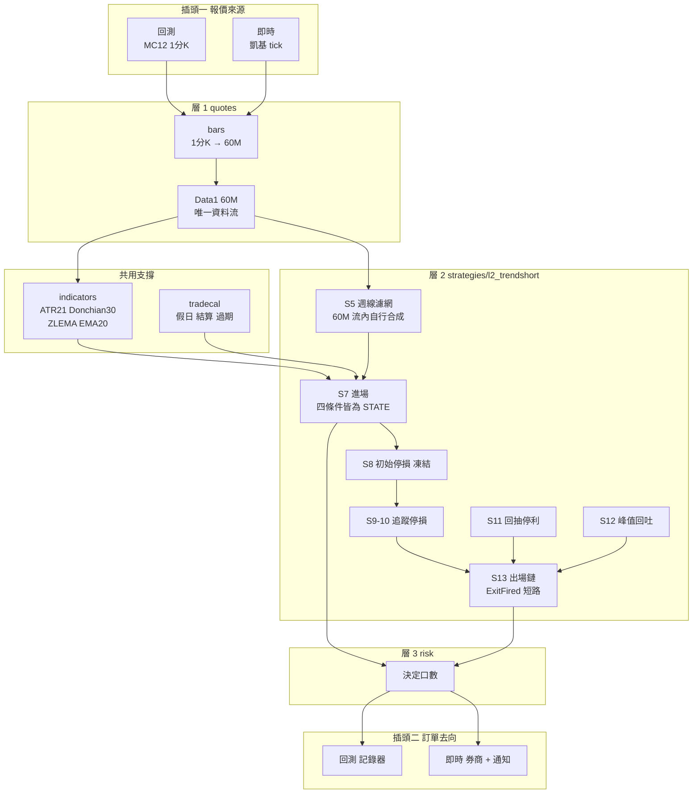

# L2 TrendShort 分層結構

> **60M · 單資料流 · IOG=false · ExitFired 單根單張**
> 五支裡最單純的一支。移植順位 1。**已完成移植。**

---

## 一 全景



> **無 Data2 / Data3。** 週線濾網在 60M 流內用陣列自行合成，
> 所以 `quotes/align.py` 對 L2 完全不需要——這是它最單純的原因。

---

## 二 層別需求

| 層 | 模組 | L2 用到什麼 | 狀態 |
|---|---|---|---|
| **0** | `types/bar` | 單條 60M BarSeries | ✓ |
| | `types/stateful` | `ZLEMA_Val[1]` `C1_Bar[1]` | ✓ |
| | `instruments` | `BigPointValue` | ✓ |
| **支撐** | `indicators/core` | `AvgTrueRange` `Lowest` `Highest` `XAverage` `MinList` | ✓ |
| | `tradecal` | 假日 · 結算 · 過期 | ✓ |
| | `engine/orders` | Market · Stop。**ExitFired 保證單張** | ○ |
| | `engine/protective` | `SetStopContract` + `SetStopLoss` | ○ |
| **1** | `quotes/bars` | 1分K → **60M** | ○ |
| | `quotes/align` | **不需要** | — |
| **2** | `strategies/l2_trendshort` | — | **✓ 完成** |
| **3** | `risk` | 決定口數 | ○ |
| **5** | `notify` / `broker` | — | ○ |

---

## 三 出場鏈 — ExitFired 短路

```mermaid
flowchart TB
    S["ExitFired = 0"] --> P0A{"Kill"}
    P0A -->|是| E1["TS_Kill · Market"]
    P0A -->|否| P0B{"註冊表過期"}
    P0B -->|是| E2["TS_RegistryEnd · Market"]
    P0B -->|否| P0C{"假日 且 Time≥300"}
    P0C -->|是| E3["TS_Holiday · Market"]
    P0C -->|否| P0D{"結算 且 Time≥1230"}
    P0D -->|是| E4["TS_Settlement · Market"]
    P0D -->|否| P1{"週五12:45<br/>Close > SMA13"}
    P1 -->|是| E5["TS_WeeklyExit · Market"]
    P1 -->|否| P2{"Close > 30根最高收"}
    P2 -->|是| E6["TS_StructureTP · Market"]
    P2 -->|否| P3{"TTP_Fire"}
    P3 -->|是| E7["TS_TTP · Market"]
    P3 -->|否| P4{"stopProfitPrice > 0"}
    P4 -->|是| E8["TS_StopProfit · Stop"]
    P4 -->|否| P5{"日盤 且 Active_SL>0"}
    P5 -->|是| E9["TS_InitSL_D / TS_TSL_D · Stop"]
    P5 -->|否| P6{"夜盤 且 Close>Active_SL"}
    P6 -->|是| E10["TS_InitSL_N / TS_TSL_N · Market"]

    style E8 fill:#4a2020,stroke:#e8735e
```



> **[D-5]** 優先級 4 一旦成立，5 與 6 永不執行——自訂停損單不再掛出，
> 保護只剩凍結的引擎停損。標頭的 45 筆虧損出場中有 4 筆是 engine Stop Loss。

---

## 四 時段判定的坑

```
IsDay   = 845 ≤ Time ≤ 1245        → 09:45 / 10:45 / 11:45 / 12:45
IsNight = 其餘                      → 16:00 … 05:00  ＋  13:45
```

> **[D-6]** **13:45 那根落在 IsNight**，走優先級 6（收盤確認 + 次根市價）。
> 次根開盤在 **15:00**，中間 1 小時 15 分無自訂停損單。
> 下限 845 永不生效——60M 網格上沒有 845..944 的戳記。

---

## 五 狀態分層

| 類別 | 變數 | 重置 |
|---|---|---|
| **per-trade** | `sl_line` `sl_trig` `sl_locked` | 空手 |
| | `accel` `nlow` `c1_bar` `c1_bar_prev` `tsl_armed` | 空手 |
| | `tsl_line` `active_tsl` `active_sl` `sl_src` | 空手 |
| | `lowest_close` `ttp_gate` `ttp_fire` | 空手 |
| | `posble_profit` `stop_profit_price` | 空手 |
| **per-session** | `wk_closes[21]` `wk_bar_count` `wk_sma_sum` `filter_ok` | **永不** |
| | `zlema_val` `zlema_prev` `ema20_val` `comp_price` | **永不** |
| **跨交易** | `last_entry_price` `reentry_armed` `reentry_price` | 進場後清 armed |
| | `prev_market_position` | 腳本最末行 |

---

## 六 執行層能力清單

| 能力 | L2 需要 |
|---|:-:|
| Market 單 | ● |
| Stop 單 | ● |
| Limit 單 | · |
| 單根多張並存 | **·（ExitFired 保證單張）** |
| 部分口數 | · |
| 腿綁定 | · |
| tick 級評估 | · |
| 多資料流對齊 | **·（唯一不需要的）** |

**L2 只需要執行層的最小集合。** 這就是它排移植順位 1 的原因。

---

## 七 移植檢查清單

- [x] 策略邏輯移植完成（`strategies/l2_trendshort.py`）
- [x] `types/stateful` 變數歷史機制
- [ ] `.pla` SHA-256 釘死
- [ ] 重跑 MC 報告（標頭 77/2.67M 與 78/2.88M 互相矛盾，皆不採用）
- [ ] `quotes/bars` 1分K → 60M 聚合器
- [ ] `engine/fill_mc12` 成交模型
- [ ] `engine/accounting` Fill → 權益曲線
- [x] D-4 週線取 **12:45** 而非註解宣稱的 13:45
- [x] D-6 `IsDay` 上限 1245，13:45 歸夜盤
- [x] D-2 追蹤停損放鬆行為照抄（比較 tsl_line、使用 active_tsl）
- [x] D-3 SL_Pct 不套用追蹤路徑
- [x] D-5 優先級 4 遮蔽 5 與 6
- [ ] **驗收：2025-06-03 之後零觸發**（停擺 443 天）。有觸發即為移植錯誤
