# L3 ConsolLong 分層結構

> **15M · 三資料流 · IOG=false · bracket 常態兩張單**
> 執行層第一次被迫支援 **Limit 單與 OCO**。移植順位 3。

---

## 一 全景

```mermaid
flowchart TB
    subgraph P1["插頭一 報價來源"]
        H1["回測<br/>MC12 1分K"]
        R1["即時<br/>凱基 tick"]
    end

    subgraph LY1["層 1 quotes"]
        AGG["bars<br/>1分K → 15M / 60M / D"]
        D1["Data1 15M<br/>執行"]
        D2["Data2 60M<br/>箱體"]
        D3["Data3 Daily<br/>濾網"]
        AL["align<br/>Highest(High,16)[1] of D2"]
    end

    subgraph SUP["共用支撐"]
        IND["indicators<br/>ATR9 Highest80<br/>SMA12 SMA20 SMA60"]
        CAL["tradecal"]
        OMS["engine/orders<br/>需 OCO"]
    end

    subgraph LY2["層 2 strategies/l3_consollong"]
        BOX["箱體偵測<br/>收縮率 ≤ 0.1"]
        QUAL["Dim1 合格<br/>Range/ATR ≥ 8.5"]
        ZONE["Dim2 支撐區<br/>Btm + Range × 0.5"]
        TGT["Dim3 動態目標<br/>min(Swing80, BoxTop)"]
        GATE["開盤封鎖 + RR 閘門"]
        ENT["進場<br/>Buy Stop at BoxBtm"]
        EXIT["出場 bracket<br/>TP Limit + SL Stop"]
    end

    subgraph LY3["層 3 risk"]
        SZ["決定口數"]
    end

    subgraph P2["插頭二 訂單去向"]
        REC["回測 記錄器"]
        BRK["即時 券商 + 通知"]
    end

    H1 --> AGG
    R1 --> AGG
    AGG --> D1 & D2 & D3
    D2 --> AL --> BOX
    D3 --> CAL
    D1 --> IND
    BOX --> QUAL --> ZONE --> ENT
    IND --> TGT --> EXIT
    GATE --> ENT
    CAL --> ENT
    ENT --> SZ
    EXIT --> OMS --> SZ
    SZ --> REC
    SZ --> BRK

    style EXIT fill:#3a3520,stroke:#f0b45a
    style OMS fill:#3a3520,stroke:#f0b45a
```

---

## 二 層別需求

| 層 | 模組 | L3 用到什麼 | 狀態 |
|---|---|---|---|
| **0** | `types/bar` | 三條 BarSeries（15M / 60M / Daily） | ✓ |
| | `types/stateful` | **`v_is_in_consolidation[1]`** episode 計數 | ✓ |
| | `instruments` | `BigPointValue` | ✓ |
| **支撐** | `indicators/core` | `AvgTrueRange(9)` `Highest(High,80)` `Average` `MaxList` `MinList` | ✓ |
| | `tradecal` | 假日 · 結算 · 過期 | ✓ |
| | **`engine/orders`** | **Market · Stop · Limit ＋ OCO 撤銷** | ○ **首次需要** |
| | `engine/protective` | `SetStopContract` + `SetStopLoss` | ○ |
| **1** | `quotes/bars` | 1分K → 15M / 60M / Daily | ○ |
| | **`quotes/align`** | `Highest(High,16)[1] of Data2` | ○ |
| **2** | `strategies/l3_consollong` | — | ○ |
| **3** | `risk` | 決定口數 | ○ |
| **5** | `notify` / `broker` | — | ○ |

---

## 三 訂單並存 — 與 L2/L4 最大差異

```mermaid
flowchart TB
    IN{"v_is_in_consolidation ?"}
    IN -->|"true<br/>盤整中"| BR["bracket 兩張同時掛出"]
    BR --> TP["CL_TP<br/>next bar at Target Limit"]
    BR --> SL["CL_SL<br/>next bar at WorkSL Stop"]
    IN -->|"false<br/>箱體失效"| BE["CL_BreakExit · Market<br/>TP 與 SL 都不再掛出"]

    SAFE["Priority 0 安全出場"] --> RE["CL_RegistryEnd"]
    SAFE --> HO["CL_Holiday · Time≥415"]
    SAFE --> SE["CL_Settlement · Time≥1230"]
    SAFE --> KL["CL_Kill<br/>獨立 if，不在鏈上"]

    TP --> CNT["一根最多四張"]
    SL --> CNT
    RE --> CNT
    KL --> CNT

    style BR fill:#3a3520,stroke:#f0b45a
    style BE fill:#4a2020,stroke:#e8735e
    style KL fill:#4a2020,stroke:#e8735e
```

> **[D-2]** 箱體一失效，`TP` 與 `SL` 兩張都不再掛出，只剩市價 `BreakExit`。
> **移植時極易漏**——因為 4.1 整個區塊在 `if v_is_in_consolidation` 之內。
>
> **[D-3]** `CL_Kill` 在 else-if 鏈外，與 L1 的 J-3 同型。

---

## 四 進場閘門鏈

```mermaid
flowchart LR
    A["空手"] --> B["箱體合格<br/>Range/ATR ≥ 8.5"]
    B --> C["60M 多方<br/>Close > SMA12"]
    C --> D["日線 OR 濾網<br/>> MA20 或 > MA60"]
    D --> E["非假日"]
    E --> F["非結算日"]
    F --> G["非開盤封鎖<br/>Time=500 或 900≤T&lt;945"]
    G --> H["RR 合格<br/>Range ≥ Btm × 0.55%"]
    H --> I["Close &lt; 支撐區"]
    I --> J["Close &gt; Btm − ATR緩衝"]
    J --> K["Buy Stop at v_Box_Btm"]
```

**開盤封鎖擋的是「成交會落在禁區」的訊號，不是訊號本身的時間。**
`Time = 500` → 09:00 成交；`Time 900..930` → 09:15..09:45 成交。

---

## 五 狀態分層

| 類別 | 變數 | 重置 |
|---|---|---|
| **per-trade** | `v_SL_Locked` `v_Frozen_SL` `v_Frozen_Target` `v_SL_Pct_Floor` | 空手 |
| | `v_BE_Armed` `v_BE_IsFloor` | 空手 |
| **per-session（需 `[1]`）** | `v_is_in_consolidation` `v_Box_Top` `v_Box_Btm` | **永不** |
| **跨交易** | `v_Episode_ID` | 永不（只增） |
| | `v_MktExit_Ordered` | **只在持倉時歸假** |
| | `v_Last_EntryPrice` `v_ReEntry_*` | episode 變更時解除 |
| | `v_Prev_MP` | 腳本最末行 |

`v_MktExit_Ordered` 的慣用法：只在 `MarketPosition = 1` 時重置，
所以轉為空手那一根仍帶著最後一次在倉的值——正是 latch 要讀的東西。

---

## 六 執行層能力清單

| 能力 | L3 需要 | 首次出現 |
|---|:-:|---|
| Market 單 | ● | |
| Stop 單 | ● | |
| **Limit 單** | ● | **L3** |
| **OCO 撤銷語意** | ● | **L3** |
| 單根多張並存 | ● | L1 |
| 多資料流對齊 | ● | L1 |
| 部分口數 | · | L5 |
| 腿綁定 | · | L5 |
| tick 級評估 | · | L1 |

---

## 七 移植檢查清單

- [ ] `.pla` SHA-256 釘死
- [ ] **釐清 v15.0 (376筆) 與 v15.1 anchor (360筆) 的測試條件**，重跑作為基準
- [ ] `engine/orders` 支援 Limit 單
- [ ] `engine/orders` 支援 OCO：一張成交，另一張撤銷
- [ ] `quotes/align` 的 `[1]` 偏移
- [ ] D-1 `SetStopContract` 位置（在盤整判斷內，可能是 bug）
- [ ] D-2 箱體失效後 TP/SL 都不掛出
- [ ] D-3 `CL_Kill` 在鏈外
- [ ] 箱體失效用 **Close**（L5 用 High/Low，勿混）
- [ ] `Range_Shrink_Rate = 0.1`（L4 是 0.7，差七倍）
- [ ] 目標兜底：`Target < Mid + ATR` 時改用 `Box_Top`
- [ ] Re-entry 定義用 **episode**，不可沿用 L2 的價格定義
- [ ] 驗收：re-entry 筆數落在登記區間 `20 ≤ CL_ReEntry ≤ 115`
