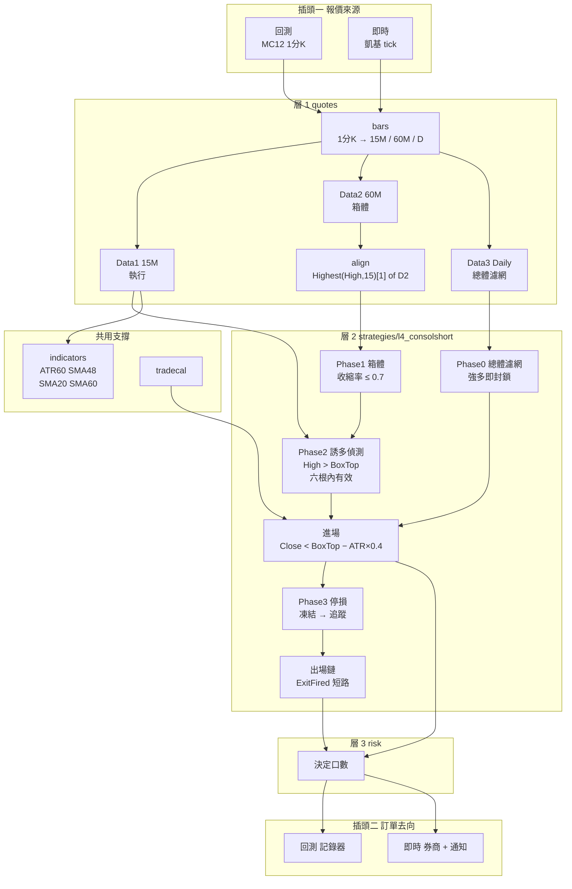
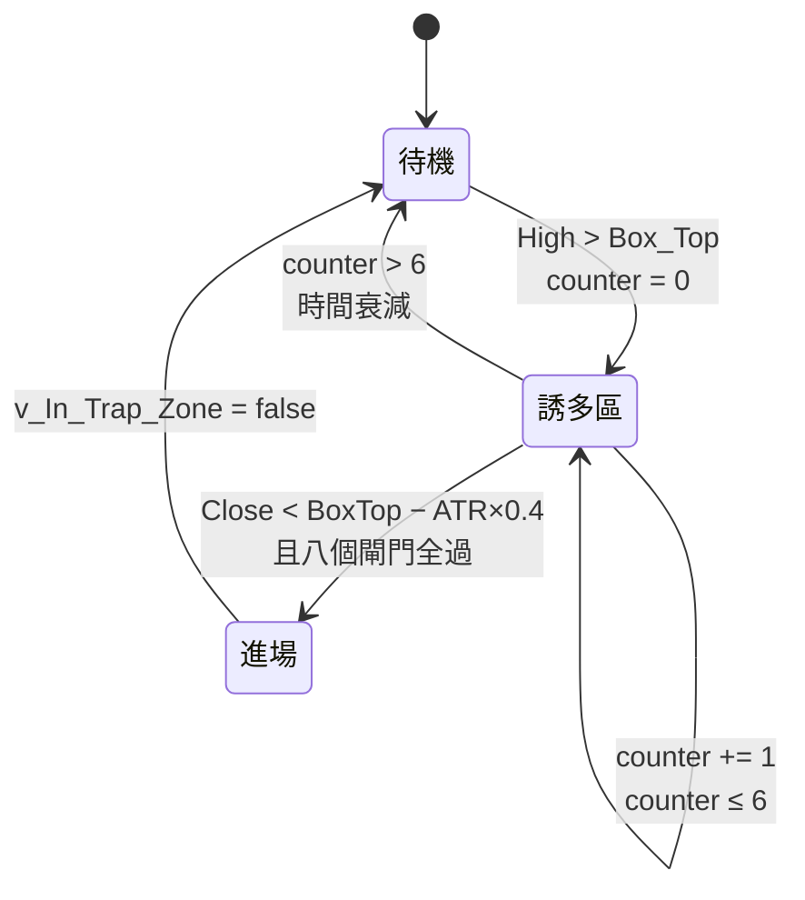

# L4 ConsolShort 分層結構

> **15M · 三資料流 · IOG=false 明宣告 · ExitFired 單根單張**
> 與 L2 同構，多了三資料流與變數歷史。移植順位 2。

---

## 一 全景

---

## 二 層別需求

| 層 | 模組 | L4 用到什麼 | 狀態 |
|---|---|---|---|
| **0** | `types/bar` | 三條 BarSeries（15M / 60M / Daily） | ✓ |
| | **`types/stateful`** | **`v_Stop_Level[1]`** 追蹤棘輪 · `MarketPosition[1]` 冷卻 | ✓ |
| | `instruments` | `BigPointValue` | ✓ |
| **支撐** | `indicators/core` | `AvgTrueRange(60)` `Highest` `Lowest` `Average` `MinList` | ✓ |
| | `tradecal` | 假日 · 結算 · 過期 | ✓ |
| | `engine/orders` | Market · Stop。**ExitFired 保證單張** | ○ |
| | `engine/protective` | `SetStopContract` + `SetStopLoss` | ○ |
| **1** | `quotes/bars` | 1分K → 15M / 60M / Daily | ○ |
| | `quotes/align` | `Highest(High,15)[1] of Data2` | ○ |
| **2** | `strategies/l4_consolshort` | — | ○ |
| **3** | `risk` | 決定口數 | ○ |
| **5** | `notify` / `broker` | — | ○ |

---

## 三 誘多狀態機 — L4 專屬

用 `High` 不是 `Close`——**影線碰到箱頂就算誘多**。
進場後立即關閉誘多區，同一次誘多只做一次。

---

## 四 停損三路徑

```mermaid
flowchart TB
    T{"v_Trail_Active ?"}
    T -->|"是<br/>Lowest_Low ≤ Locked_Btm"| TR["追蹤<br/>MinList(v_Stop_Level[1],<br/>Lowest_Low + 1.0×ATR)"]
    T -->|否| F{"Freeze_SL_On ?"}
    F -->|"是<br/>production"| FR["凍結<br/>Frozen_LockedTop<br/>+ 2.0 × Frozen_ATR"]
    F -->|否| DY["動態<br/>Locked_Top + 2.0×ATR<br/>Locked_Top 向下棘輪"]

    TR --> CAP["統一封頂<br/>MinList(stop,<br/>Entry × (1+1.50%))"]
    FR --> CAP
    DY --> CAP
    CAP --> LBL["標籤路由<br/>CS_SP > CS_BE > CS_SL"]

    style TR fill:#3a3520,stroke:#f0b45a
```

> **`v_Stop_Level[1]` 是追蹤棘輪的全部。** 歷史值取錯，整條追蹤停損失效**且不報錯**。
> 這是 `types/stateful.py` 存在的直接原因。
>
> **與 L2 相反**：L4 的 SL_Pct **統一套用於全部路徑**，L2 只封頂初始停損。

---

## 五 出場鏈 — ExitFired 短路

```mermaid
flowchart TB
    S["ExitFired = 0"] --> P0A{"Kill"}
    P0A -->|是| E1["CS_Kill · Market"]
    P0A -->|否| P0B{"註冊表過期"}
    P0B -->|是| E2["CS_RegistryEnd · Market"]
    P0B -->|否| P0C{"假日 且 Time≥415"}
    P0C -->|是| E3["CS_Holiday · Market"]
    P0C -->|否| P0D{"結算 且 Time≥1230"}
    P0D -->|是| E4["CS_Settlement · Market"]
    P0D -->|否| P1{"箱體失效<br/>且 Close of D2 > Locked_Top"}
    P1 -->|是| E5["CS_BreakExit · Market"]
    P1 -->|否| P2{"追蹤未啟動<br/>且 BarsSinceEntry ≥ 60"}
    P2 -->|是| E6["CS_TimeExit · Market"]
    P2 -->|否| E7["CS_SP / CS_BE / CS_SL · Stop"]

    style P1 fill:#3a3520,stroke:#f0b45a
```

> **[D-3]** 優先級 1 **只認向上突破**。箱體向下失效（對空單有利）不出場，
> 但 Phase 2 整個區塊停止執行——誘多偵測與 P3b 都不再更新。

---

## 六 狀態分層

| 類別 | 變數 | 重置 |
|---|---|---|
| **per-trade** | `v_Lowest_Low` `v_Trail_Active` | 空手 |
| | `v_SL_Locked` `v_Frozen_ATR` `v_Frozen_LockedTop` | 空手 |
| | `v_Peak_Profit_Pts` `v_BE_*` `v_SP_*` `v_SL_Pct_Ceil` | 空手 |
| | **`v_Stop_Level`（需 `[1]`）** | **[D-4] 未顯式重置** |
| **跨交易** | `v_Locked_Top` `v_Locked_Btm` | **只在空手時快照** |
| | `v_BarsSinceExit` | 持倉時歸 0 |
| | `v_Episode_ID` `v_Episode_Entries` | 新箱體時 Entries 歸 0 |
| | `v_Prev_MP` | 腳本最末行 |
| **per-session** | `v_is_in_consolidation` `v_Box_Top` `v_Box_Btm` | 永不 |
| | `v_In_Trap_Zone` `v_Trap_Counter` | 進場時關閉誘多區 |

---

## 七 執行層能力清單

| 能力 | L4 需要 |
|---|:-:|
| Market 單 | ● |
| Stop 單 | ● |
| Limit 單 | · |
| 單根多張並存 | **·（ExitFired 保證單張）** |
| 多資料流對齊 | ● |
| 變數歷史 `[1]` | ● |
| 部分口數 | · |
| 腿綁定 | · |
| tick 級評估 | · |

**L4 = L2 的能力集合 ＋ 多資料流 ＋ 變數歷史。** 這是它排順位 2 的原因。

---

## 八 移植檢查清單

- [ ] `.pla` SHA-256 釘死
- [ ] **重跑 MC 報告**（877,200 vs 894,400 同為 79 筆，出處無法回溯，兩者皆不採用）
- [ ] `quotes/align` 的 `[1]` 偏移
- [ ] `types/stateful` 的 `v_Stop_Level[1]` 棘輪語意驗證
- [ ] `MarketPosition[1]` 冷卻計數
- [ ] D-1 `SetStopLoss` 在盤整判斷內（`SetStopContract` 在頂層）
- [ ] D-2 凍結中間變數而非價位（與 L1/L2/L3 不同）
- [ ] D-3 `BreakExit` 只認向上突破
- [ ] D-4 `v_Stop_Level` 未列入空手重置清單
- [ ] 箱體失效用 **Close**（L5 用 High/Low，勿混）
- [ ] `Range_Shrink_Rate = 0.7`（L3 是 0.1，差七倍）
- [ ] 深夜封鎖 **200–500**（L5 是 400–500，區間不同）
- [ ] SL_Pct **統一套用全路徑**（L2 只封頂初始停損）
- [ ] BE / SP 死碼是否移植（`BE_Trigger_Pts = 0`、`SP_Trigger_Pts = 0`）
- [ ] 驗收：`mc12` 模式產出 **79 筆**。多頭期間零觸發是預期，不是錯誤
