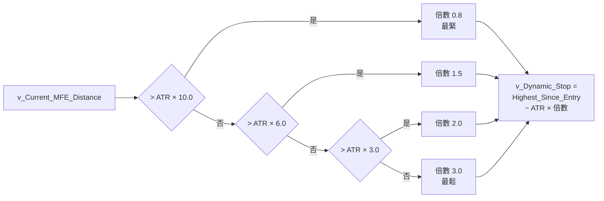

# L5 BreakoutLong 分層結構

> **15M · Data2 是 Daily · IOG=false · 雙腿 + 分批 + from Entry 綁定**
> 部位模型最複雜的一支。執行層第一次被迫支援完整 OMS。移植順位 4。

---

## 一 全景

```mermaid
flowchart TB
    subgraph P1["插頭一 報價來源"]
        H1["回測<br/>MC12 1分K"]
        R1["即時<br/>凱基 tick"]
    end

    subgraph LY1["層 1 quotes"]
        AGG["bars<br/>1分K → 15M / D / W"]
        D1["Data1 15M<br/>執行"]
        D2["Data2 Daily<br/>四日箱體"]
        D3["Data3 Weekly<br/>AND 濾網"]
        AL["align<br/>Highest(High,4)[1] of D2"]
    end

    subgraph SUP["共用支撐"]
        IND["indicators<br/>ATR35 SMA60<br/>SMA20 SMA60"]
        CAL["tradecal"]
        INST["instruments<br/>MinMove / PriceScale"]
        OMS["engine/orders + position<br/>多腿 · 分批 · 綁定"]
    end

    subgraph LY2["層 2 strategies/l5_breakoutlong"]
        BOX["箱體<br/>失效用 High/Low"]
        RR["RR 閘門 ≥ 1.1"]
        E1["Bot 腿<br/>Buy Stop at BoxBtm"]
        E2["Mid 腿<br/>Buy Stop at MidLine"]
        S1["Stage1 全倉<br/>TP 40% + SL"]
        S23["Stage2/3 跑單<br/>MFE 三階追蹤"]
    end

    subgraph LY3["層 3 risk"]
        SZ["決定口數<br/>兩腿如何分配"]
    end

    subgraph P2["插頭二 訂單去向"]
        REC["回測 記錄器"]
        BRK["即時 券商 + 通知"]
    end

    H1 --> AGG
    R1 --> AGG
    AGG --> D1 & D2 & D3
    D2 --> AL --> BOX
    D3 --> CAL
    D1 --> IND
    INST --> RR
    BOX --> RR --> E1 & E2
    CAL --> E1
    E1 --> S1 --> S23
    E2 --> S1
    S1 --> OMS
    S23 --> OMS
    OMS --> SZ
    SZ --> REC
    SZ --> BRK

    style OMS fill:#3a3520,stroke:#f0b45a
    style E1 fill:#3a3520,stroke:#f0b45a
    style E2 fill:#3a3520,stroke:#f0b45a
```

---

## 二 層別需求

| 層 | 模組 | L5 用到什麼 | 狀態 |
|---|---|---|---|
| **0** | `types/bar` | 三條 BarSeries（15M / **Daily** / Weekly） | ✓ |
| | `types/stateful` | `v_is_in_consolidation[1]` | ✓ |
| | **`instruments`** | **`MinMove` / `PriceScale` → TickSize** | ✓ **L5 專屬** |
| **支撐** | `indicators/core` | `AvgTrueRange(35)` `Highest` `Lowest` `Average` `MaxList` `MinList` | ✓ |
| | `tradecal` | 假日 · 結算 · 過期 | ✓ |
| | **`engine/orders`** | **Market · Stop · Limit ＋ 部分口數 ＋ 腿綁定** | ○ |
| | **`engine/position`** | **多腿部位 · `CurrentContracts` / `MaxContracts`** | ○ **L5 專屬** |
| | `engine/protective` | `SetStopContract` + `SetStopLoss`（可無出場單平倉） | ○ |
| **1** | `quotes/bars` | 1分K → 15M / Daily / Weekly | ○ |
| | `quotes/align` | `Highest(High,4)[1] of Data2` | ○ |
| **2** | `strategies/l5_breakoutlong` | — | ○ |
| **3** | `risk` | **兩腿如何分配口數** | ○ |
| **5** | `notify` / `broker` | — | ○ |

---

## 三 雙腿部位模型 — L5 專屬

```mermaid
flowchart TB
    BOX["箱體成立"] --> LEG1["Bot 腿<br/>Buy Stop at v_Box_Btm"]
    BOX --> LEG2["Mid 腿<br/>Buy Stop at v_Mid_Line"]

    LEG1 -->|成交| POS["部位<br/>CurrentContracts"]
    LEG2 -->|成交| POS

    POS --> ST{"CurrentContracts<br/>== MaxContracts ?"}
    ST -->|"是<br/>Stage 1 全倉"| S1["TP 40% Limit<br/>+ SL 全倉 Stop<br/>+ TimeExit 31根"]
    ST -->|"否<br/>Stage 2/3 跑單"| S23["Trail > SP > BE"]

    S1 -.->|"TP 成交<br/>出 40%"| ST

    style LEG1 fill:#3a3520,stroke:#f0b45a
    style LEG2 fill:#3a3520,stroke:#f0b45a
```

**所有出場單都帶 `from Entry("BL_Entry_Bot")` 或 `from Entry("BL_Entry_Mid")`，共 28 處。**

> 標頭說明為何 L5 沒有 re-entry 標籤：
> 「Renaming an entry **orphans every exit bound to it and the position loses all stops.**」
> L2/L3/L4 有零個綁定，所以它們可以在進場側加標籤，L5 不行——改用 Print 日誌。

---

## 四 MFE 三階追蹤

追蹤啟動條件：`High > v_Box_Top + ATR × 2.5`——**必須突破箱頂**。

---

## 五 訂單數上限

```mermaid
flowchart TB
    IN{"盤整中 且 Stage 1 ?"}
    IN -->|是| A["TP × 2 腿"]
    IN -->|是| B["SL × 2 腿"]
    IN -->|是| C["TimeExit × 2 腿"]
    SAFE["Priority 0"] --> D["Kill / Registry / Holiday<br/>/ Settlement × 2 腿"]
    A --> T["一根最多 8 張"]
    B --> T
    C --> T
    D --> T

    style T fill:#4a2020,stroke:#e8735e
```

> **執行層必須支援每腿獨立的訂單集合，且腿與腿之間互不干擾。**

---

## 六 引擎停損的盲點

> **實測：171 筆中有 1 筆。**
> **Python 必須把引擎停損記成一種獨立的出場類型**，
> 否則對帳會出現「有平倉但找不到對應出場單」。

---

## 七 狀態分層

| 類別 | 變數 | 重置 |
|---|---|---|
| **per-trade** | `v_Highest_Since_Entry` `v_Trail_Active` `v_Dynamic_Trail_Mult` | 空手 |
| | `v_SL_Locked` `v_Frozen_ATR` `v_Frozen_ATR_Buffer` | 空手 |
| | `v_Peak_Profit` `v_SP_Armed` `v_SP_Floor` | 空手 |
| | `v_Bot_Base_Stop` `v_Mid_Base_Stop` `v_SL_Pct_Floor` | 空手 |
| **per-session（需 `[1]`）** | `v_is_in_consolidation` `v_Box_Top` `v_Box_Btm` | 永不 |
| **跨交易** | `v_Episode_ID` `v_Episode_Entries` | 新箱體時 Entries 歸 0 |
| | `v_Prev_MP` | 腳本最末行 |
| **引擎提供** | **`CurrentContracts` `MaxContracts`** | — |

> `CurrentContracts` 與 `MaxContracts` **不是策略變數，是引擎狀態**。
> Stage 判定完全靠它們，所以 `engine/position.py` 必須提供。

---

## 八 執行層能力清單

| 能力 | L5 需要 | 首次出現 |
|---|:-:|---|
| Market 單 | ● | |
| Stop 單 | ● | |
| Limit 單 | ● | L3 |
| 單根多張並存 | ● | L1 |
| **部分口數出場** | ● | **L5** |
| **腿綁定 from Entry** | ● | **L5** |
| **CurrentContracts / MaxContracts** | ● | **L5** |
| **TickSize = MinMove/PriceScale** | ● | **L5** |
| **引擎停損作為獨立出場類型** | ● | **L5** |
| 多資料流對齊 | ● | L1 |
| tick 級評估 | · | L1 |

---

## 九 移植檢查清單

- [ ] `.pla` SHA-256 釘死
- [ ] **重跑 v19.9 的 MC 報告**（v19.6 基線在 v19.7 之後未重測）
- [ ] `engine/position` 多腿部位模型
- [ ] `engine/orders` 部分口數 + `from Entry` 綁定
- [ ] `CurrentContracts` / `MaxContracts` 追蹤
- [ ] **引擎停損記成獨立出場類型**（171 筆中 1 筆無對應出場單）
- [ ] `instruments` 的 `MinMove` / `PriceScale`
- [ ] D-1 箱體失效用 **High/Low**（L3/L4 用 Close，勿混）
- [ ] D-2 SL_Pct 錨在 **`v_Box_Btm`**（其餘四支錨在 Close）
- [ ] Data2 是 **Daily**（L3/L4 是 60M，勿混）
- [ ] `Lookback_Bars = 4` 是**四個日線**，不是四小時
- [ ] 週線濾網用 **AND**（L1 用 OR，勿混）
- [ ] 深夜封鎖 **400–500**（L4 是 200–500，且 L5 夜盤是獲利的）
- [ ] 無 `DayOfWeek = 7` 的比較（v19.7 已移除死碼）
- [ ] SL_Pct **不套用** Stage 2/3 跑單（標頭明載）
- [ ] `Debug_Entry_Log` 在最佳化掃描前設 False
- [ ] SP 死碼（`SP_Trigger_Pts = 0`）是否移植
